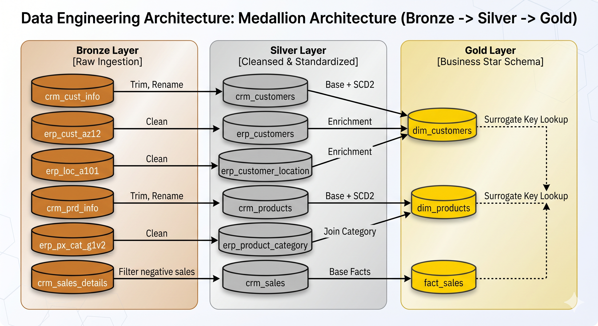
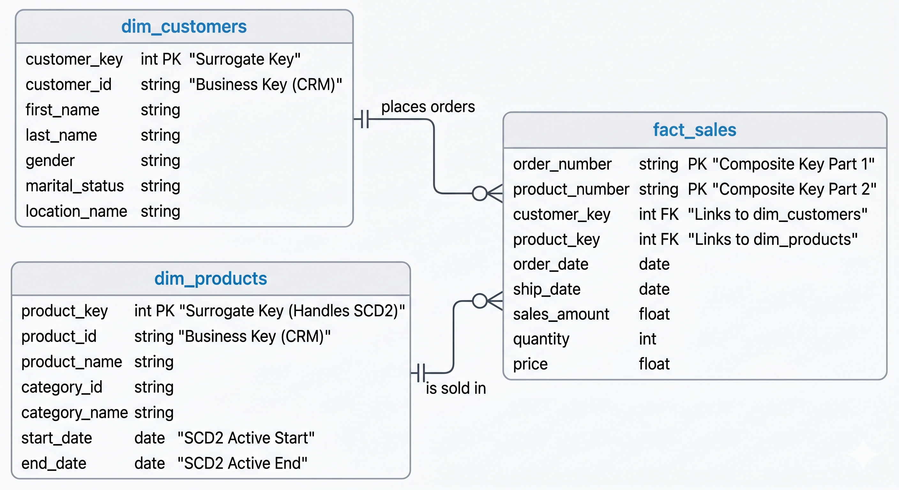

# 🚲 Databricks Bike Data Lakehouse Project


This repository documents an end-to-end Databricks Lakehouse built with the **Medallion Architecture**. It ingests raw CRM and ERP files, cleans and standardizes them, models them into a star schema, and prepares the workflow for orchestration in Databricks.

## 📖 Overview
The project is organized into three data layers and one automation layer. The final goal is to produce reliable analytics tables for reporting and BI:

*   **Bronze:** Raw ingestion with no transformations.
*   **Silver:** Cleansing, standardization, and validation.
*   **Gold:** Business-ready dimensional modeling.
*   **Pipeline:** Orchestration with Databricks Workflows.



---

## 🗂️ Repository Structure
```text
script/
├── init_lakehouse.ipynb
├── utils/
│   └── config.ipynb            # Centralized config — schemas, table registry
├── bronze/
│   └── bronze_layer.ipynb
├── silver/
│   ├── silver_orchestration.ipynb
│   ├── crm/
│   │   ├── silver_crm_cust_info.ipynb
│   │   ├── silver_crm_prd_info.ipynb
│   │   └── silver_crm_sales_details.ipynb
│   └── erp/
│       ├── silver_erp_cust_az12.ipynb
│       ├── silver_erp_loc_a101.ipynb
│       └── silver_erp_px_cat_g1v2.ipynb
└── gold/
    ├── gold_orchestration.ipynb
    ├── gold_dim_customers.ipynb
    ├── gold_dim_products.ipynb
    └── gold_fact_sales.ipynb
```

---

## ⚙️ Setup Instructions

**1. Prepare the workspace**
Use a Databricks workspace with Unity Catalog enabled. Create or confirm the following schemas:
*   `bronze`
*   `silver`
*   `gold`
*   `monitoring`

**2. Create the raw file volume**
Create a volume in the Bronze schema to act as the landing zone:
`workspace.bronze.raw_sources`

**3. Upload source data**
Place the six source CSV files into the `raw_sources` volume.

**4. Initialize the lakehouse**
Run the initialization script. This notebook prepares the schemas, storage, and audit log table needed for the project.
```bash
script/init_lakehouse.ipynb
```

---

## 🚀 Execution Flow

### 🥉 Bronze Layer
Run the ingestion notebook:
```bash
script/bronze/bronze_layer.ipynb
```
This notebook reads each source CSV and writes it as a Delta table in `workspace.bronze` using a consistent naming convention.

### 🥈 Silver Layer
Run the orchestration notebook:
```bash
script/silver/silver_orchestration.ipynb
```
This notebook triggers the Silver transformation notebooks in sequence. The Silver layer cleans, standardizes, and validates data before writing to `workspace.silver`.

### 🥇 Gold Layer
Run the dimensional modeling notebook:
```bash
script/gold/gold_orchestration.ipynb
```
This notebook builds the dimensional model in `workspace.gold`, including customer, product, and sales tables for analytics.

---

## 📊 Data Model Outputs



**Silver Outputs**
The Silver layer produces cleaned, standardized tables such as:
*   `workspace.silver.crm_customers`
*   `workspace.silver.crm_products`
*   `workspace.silver.crm_sales`
*   `workspace.silver.erp_customers`
*   `workspace.silver.erp_customer_location`
*   `workspace.silver.erp_product_category`

**Gold Outputs**
The Gold layer creates the final Star Schema:
*   `workspace.gold.dim_customers`
*   `workspace.gold.dim_products`
*   `workspace.gold.fact_sales`

---

## 🔄 Pipeline Automation
The pipeline is designed to run as a Databricks Workflow named `loading_bike_data_lakehouse`.

**Recommended Task Order:**
1.  Bronze ingestion
2.  Silver orchestration
3.  Gold orchestration


---

## ✅ Production-Grade Enhancements

Beyond the base Lakehouse, four production engineering patterns were implemented:

### 1. 📋 Data Quality Framework
Every Silver notebook includes a validation block that runs after each write. Checks enforced:

| Check | Rule |
|---|---|
| Row count | `total_rows > 0` — table must not be empty |
| Null PKs | `null_pk == 0` — primary key must be fully populated |
| Duplicate PKs | `duplicate_pk == 0` — no duplicate primary keys allowed |
| Business rules | e.g. `sales_amount > 0` on `crm_sales` |

QC is intentionally placed at the **Silver layer**, not Gold. Gold is a transformation layer — if corrupt data reaches Gold, failures are silent. Silver is the last point where raw data shape can be enforced.

### 2. 🔁 Incremental MERGE Strategy
Silver writes use `MERGE INTO` (upsert) instead of full overwrite. This means each pipeline run only touches rows that are new or changed — leaving unaffected rows untouched.

```python
# Pattern used across all 6 silver notebooks
if not spark.catalog.tableExists(TARGET_TABLE):
    df.write.format("delta").saveAsTable(TARGET_TABLE)   # first run
else:
    delta_target = DeltaTable.forName(spark, TARGET_TABLE)
    delta_target.alias("target").merge(
        df.alias("source"),
        f"target.{PK_COL} = source.{PK_COL}"
    ).whenMatchedUpdateAll().whenNotMatchedInsertAll().execute()
```

`crm_sales` uses a **composite key** `(order_number, product_number)` because no single column uniquely identifies a row in that table.

### 3. ⚙️ Centralized Configuration
All Silver and Gold notebooks source table names and schema references from a single config notebook (`utils/config`), loaded via `%run`:

```python
CATALOG            = "workspace"
SILVER_SCHEMA      = "silver"
GOLD_SCHEMA        = "gold"
MONITORING_SCHEMA  = "monitoring"

TABLES = {
    "crm_cust":  f"{CATALOG}.{SILVER_SCHEMA}.crm_customers",
    "crm_prd":   f"{CATALOG}.{SILVER_SCHEMA}.crm_products",
    "crm_sales": f"{CATALOG}.{SILVER_SCHEMA}.crm_sales",
    "erp_cust":  f"{CATALOG}.{SILVER_SCHEMA}.erp_customers",
    "erp_loc":   f"{CATALOG}.{SILVER_SCHEMA}.erp_customer_location",
    "erp_cat":   f"{CATALOG}.{SILVER_SCHEMA}.erp_product_category",
    "audit_log": f"{CATALOG}.{MONITORING_SCHEMA}.pipeline_audit_log",
}
```

Centralizing table references means environment promotion (dev → prod) requires changing one file, not touching every pipeline notebook.

### 4. 📡 Monitoring & Observability
Every Silver notebook writes one audit row to a dedicated monitoring table after each pipeline run. This makes pipeline health visible and queryable.

**Audit log table:** `workspace.monitoring.pipeline_audit_log`

| Column | Type | Description |
|---|---|---|
| `notebook_name` | STRING | Which notebook ran |
| `target_table` | STRING | Which silver table was written |
| `run_timestamp` | TIMESTAMP | When the run completed |
| `rows_inserted` | LONG | Rows added by MERGE |
| `rows_updated` | LONG | Rows modified by MERGE |
| `rows_deleted` | LONG | Rows removed by MERGE |
| `qc_status` | STRING | `PASS` or `FAIL` |
| `qc_message` | STRING | Failure reason or `All checks passed` |

QC asserts are wrapped in `try/except AssertionError` so the audit log is always written — whether the pipeline passes or fails. A pipeline that crashes silently is unobservable; a pipeline that logs its failure is debuggable.

Each Silver notebook includes a final sanity check cell that displays the audit log sorted by most recent runs first:
```python
spark.sql(f"SELECT * FROM {TABLES['audit_log']} ORDER BY run_timestamp DESC").display()
```

### 5. 🧪 CI/CD & Automated Testing
A continuous integration pipeline and automated test suite ensure the configuration integrity and code quality across all pipeline notebooks.

**Why This Matters**

In a production lakehouse, configuration drift is a silent killer. A typo in a schema name, a missing table key in `TABLES`, or an accidental hardcoded catalog reference can break an entire downstream workflow — often only discovered during a late-night production run. Automated testing catches these issues before they reach production.

Additionally, notebook code is notoriously difficult to lint and test compared to plain Python files. The CI/CD setup bridges this gap by treating notebooks as testable, lintable artifacts.

**What Was Implemented**

Three components work together to enforce quality gates on every push:

**1. GitHub Actions Workflow** (`.github/workflows/pipeline_ci.yml`)

Triggers automatically on every push or pull request to `main`. The workflow performs:

*   **Code Quality Check**: Runs `nbqa ruff` to lint all notebooks using Ruff (a fast Python linter). This catches PEP 8 violations, unused imports, undefined variables, and other code smells directly inside `.ipynb` files.
*   **Automated Tests**: Executes the pytest test suite against the centralized config notebook to validate configuration integrity.

```yaml
name: PySpark CI

on:
  push:
    branches: [main]
  pull_request:
    branches: [main]

jobs:
  pyspark-test:
    runs-on: ubuntu-latest

    steps:
      - name: Checkout code
        uses: actions/checkout@v4

      - name: Set up Python
        uses: actions/setup-python@v5
        with:
          python-version: '3.11'

      - name: Install nbqa ruff pytest nbformat
        run: pip install nbqa ruff pytest nbformat
      
      - name: Run the linter on notebooks
        run: nbqa ruff .

      - name: Run tests
        run: pytest tests/ -v
```

**2. Test Suite** (`tests/test_config.py`)

Validates the `utils/config.ipynb` notebook programmatically by extracting and executing its code cells, then asserting on critical properties:

| Test | Purpose |
|---|---|
| `test_catalog_equals_workspace` | Ensures `CATALOG` variable is always set to `"workspace"` — prevents accidental references to dev or staging catalogs |
| `test_tables_keys` | Verifies all seven expected table keys exist in the `TABLES` dictionary (`crm_cust`, `crm_prd`, `crm_sales`, `erp_cust`, `erp_loc`, `erp_cat`, `audit_log`) — catches missing or renamed keys before pipelines break |
| `test_tables_values_fully_qualified` | Confirms every table reference is a fully qualified three-part name (`catalog.schema.table`) — prevents ambiguous references that fail in Unity Catalog environments |

The test suite uses `nbformat` to parse notebook JSON, extract code cells, and execute them in a sandboxed namespace. This allows testing notebook configuration as if it were a standard Python module.

**3. Development Dependencies** (`requirements-dev.txt`)

Pins exact versions of testing and linting tools to ensure reproducible CI runs:

```text
nbqa==1.9.1       # Enables running quality tools (ruff, black, mypy) on Jupyter notebooks
ruff==0.4.4       # Fast Python linter — replaces flake8, isort, and pylint
pytest==8.2.0     # Testing framework
nbformat==5.10.4  # Parses and validates Jupyter notebook format
```

**Purpose & Impact**

This CI/CD setup provides four critical safeguards:

1.  **Early Detection**: Configuration errors are caught in seconds during development, not hours later during a workflow run.
2.  **Enforced Standards**: Code quality is non-negotiable — linting failures block merges, ensuring every notebook meets baseline quality standards.
3.  **Regression Prevention**: Tests act as regression guards. If a refactor accidentally breaks the config structure, the test suite fails before code is merged.
4.  **Team Scalability**: New contributors can safely modify notebooks knowing the CI pipeline will catch breaking changes. This lowers the barrier to collaboration.

In production, this means fewer pipeline failures, faster debugging when issues do occur, and higher confidence in promoting code across environments.

---

## 🎯 Purpose & Usage
This project demonstrates a practical Databricks Lakehouse implementation using:
*   Medallion Architecture (Bronze / Silver / Gold)
*   Unity Catalog governance
*   Delta tables with ACID guarantees
*   Incremental MERGE pipelines
*   Data Quality validation at the Silver layer
*   Config-driven, environment-portable notebook design
*   Dimensional modeling (Star Schema)
*   Workflow orchestration via Databricks Jobs
*   Pipeline observability via Delta audit log (`workspace.monitoring`)
*   CI/CD automation with GitHub Actions
*   Automated testing for configuration integrity